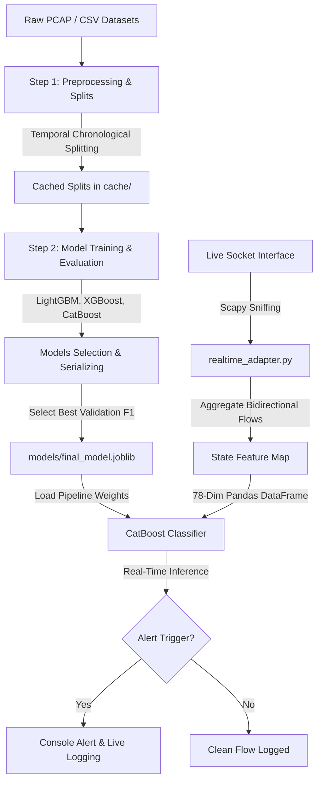

# Binary HTTP Flood Attack Detection Pipeline

This repository implements a production-grade, temporal-aware binary machine learning pipeline designed to detect HTTP-based flooding and Denial of Service (DoS) attacks at the flow level using network packet header features.

---

## 1. System Architecture

The pipeline consists of a **Modular Preprocessing & Training Loop** and a **Real-Time Capture Sniffer (Adapter)** running live inference on raw socket streams:



### Core Design Principles
*   **Per-Class Temporal Splitting**: To prevent data leakage and chronological distortion, data splitting is performed sequentially *within* each class (70% train, 10% validation, 20% test) before merging, ensuring chronological consistency.
*   **No Leakage Guarantee**: All scaling, imputing, and encoding parameters are fit exclusively on the training split and applied to the validation, test, and external sets.
*   **Oversampling-Free Balancing**: Training data uses a strict 1:1 ratio (150,000 Benign vs 150,000 Attack) selected without replacement to avoid duplicate learning loops.

---

## 2. Codebase Modularity (Step-by-Step Breakdown)

The codebase is split into modular execution layers to allow isolated optimization:

### 1. `src/step1_preprocess.py`
*   **Objective**: Standardizes data splits, aligns features, and prevents leakage.
*   **Key Functions**:
    *   `temporal_split()`: Sorts rows chronologically and slices train/val/test splits without shuffling.
    *   `remove_rows_seen_in_training()`: Purges any exact flows seen in training from evaluation datasets.
    *   `select_compatible_feature_columns()`: Automatically aligns columns between CSE-CIC-IDS2018 (Train) and CIC-IDS2017 (OOD) sets.
    *   *Output*: Serializes aligned training matrices to `cache/preprocessed_data.joblib` and writes `reports/run_metadata.json`.

### 2. `src/step2_train.py`
*   **Objective**: Fits classifiers, serializes model binaries, and scores predictions.
*   **Key Functions**:
    *   `build_models()`: Sets up pipeline structures including scaling and imputation.
    *   `evaluate_model()`: Computes accuracy, weighted/macro precision, recall, F1, ROC AUC, and PR AUC.
    *   *Output*: Saves trained LGBM, XGBoost, and CatBoost models under `models/` and selects the best performer (`models/final_model.joblib`) based on validation Macro F1.

### 3. `src/step3_reports.py`
*   **Objective**: Compiles pipeline statistics into markdown reports.
*   *Output*: Generates 6 curriculum evaluation reports under `reports/`.

---

## 3. Dataset Overview
1.  **Training & Validation**: `training_binary.csv` (300,000 rows, balanced 50% Benign vs 50% Attack (comprising HOIC, Hulk, Slowloris, SlowHTTPTest, and GoldenEye)).
    *   *Compressed file*: `datasets/training_binary.rar`
2.  **External Generalization**: `DDos_pcap_binary_external.csv` (918,437 rows, Thursday + Friday afternoon PCAP flows from CIC-IDS2017). Used purely as out-of-distribution validation.
    *   *Compressed files*: `datasets/DDos_pcap_binary_external.part1.rar` & `part2.rar`
3.  **Raw Merged Chronological Set**: `datasetcopy.csv` (2,975,417 rows, containing the raw merged capture days preserving the real-world class skew).
    *   *Compressed files*: `datasets/datasetcopy.part01.rar` to `part03.rar`

---

## 4. How to Run

### Step 1: Extract the Datasets
Extract the split volumes directly into the `datasets/` directory:
```powershell
# Using WinRAR
& "C:\Program Files\WinRAR\WinRAR.exe" x "datasets/training_binary.rar" "datasets/"
& "C:\Program Files\WinRAR\WinRAR.exe" x "datasets/DDos_pcap_binary_external.part1.rar" "datasets/"
& "C:\Program Files\WinRAR\WinRAR.exe" x "datasets/datasetcopy.part01.rar" "datasets/"
```

### Step 2: Run the Modular Training Pipeline
You can run the orchestrator script to automate Step 1, 2, and 3 sequentially, or execute them step-by-step:
```powershell
# Run the entire pipeline (Orchestrator)
python src/run_pipeline.py

# Step-by-step execution:
# 1. Preprocessing & Data Splitting
python src/step1_preprocess.py
# 2. Model Training & Evaluation
python src/step2_train.py
# 3. Report Generation
python src/step3_reports.py
```

### Step 3: Run the Ablation Study
To run the ablation experiments analyzing class balancing, temporal splitting, and feature group removal (running memory-safe systematic sampling on ~495k rows):
```powershell
python src/run_ablation_study.py
```
Ablation outputs are written to [reports/ablation_study.md](file:///d:/HTTP%20flood%20attack/reports/ablation_study.md).

---

## 5. Ablation Study Findings (Systematic Analysis)

The ablation study executes three experiments to demonstrate the necessity of balancing, temporal sorting, and rate features:

### Ablation Metrics Comparison

| Experiment Setup | LightGBM F1-Macro | XGBoost F1-Macro | CatBoost F1-Macro | Core Lesson |
| :--- | :---: | :---: | :---: | :--- |
| **Baseline (Temporal + Balanced)** | **0.706019** | **0.704558** | **0.675599** | Reference performance threshold. |
| **Exp 1: No Class Balancing** | 0.398107 | 0.386246 | 0.421820 | Dropping balancing drops generalization by **-30%** as trees overfit benign majority. |
| **Exp 2: Random Splitting** | 0.999983 | 1.000000 | 1.000000 | Random split causes **leakage**, artificially inflating F1 to 1.00. |
| **Exp 3: Dropping Rate Features** | 0.372553 | 0.373492 | 0.390447 | Dropping rate group drops generalization by **-33%**, showing rates are critical. |

---

## 6. Real-Time Detection & Emulation

The real-time detection adapter sniffs loopback packets, groups them into flow tuples, calculates features, and runs inference.

### 🛡️ Feature Fingerprints Used by the Model
By analyzing feature importances, we discovered that tree-based models rely heavily on specific transport-layer options rather than raw packet counts alone:
1.  **`Fwd Seg Size Min` (TCP Header Length)**: (Importance = **36.4%**). Attacks use custom TCP options yielding a header size of `32` bytes compared to standard `20` byte headers.
2.  **`Init Fwd Win Byts` (TCP Client Window Size)**: (Importance = **32.5%**). Attacks hardcode their socket window sizes to values like **`26883`** or **`32738`** instead of typical OS defaults.
3.  **`Dst Port`**: (Importance = **16.9%**). Attacks strictly target port **`80`**.

### Testing the Sniffer on Localhost

1.  **Terminal 1: Start the Sniffer Adapter**
    *Ensure you install Npcap with the 'WinPcap API-compatible Mode' checked, then run:*
    ```powershell
    python src/realtime_adapter.py --interface "Software Loopback Interface 1"
    ```
2.  **Terminal 2: Launch the Traffic Emulator**
    *   **Benign Standard Traffic**:
        ```powershell
        python src/emulate_attacks.py --type benign --target 127.0.0.1 --count 20
        ```
    *   **Fingerprint-Matched Attack Traffic** (Sends TCP options matching the 2018 GoldenEye/Slowloris signature to trigger alerts):
        ```powershell
        python -c "from scapy.all import IP, TCP, send; send(IP(src='127.0.0.1', dst='127.0.0.1')/TCP(sport=54321, dport=80, flags='S', window=26883, options=[('MSS', 1460), ('NOP', None), ('WScale', 8)]), count=500)"
        ```
3.  **Verbose Demo Trace**:
    You can run the un-buffered trace script to see packet capture, aggregation, 78-dim feature extraction, and CatBoost scoring printed step-by-step in your terminal:
    ```powershell
    python scratch/demo_realtime_inference.py
    ```

---

## 7. Windows Capture (Npcap) Troubleshooting

If Scapy throws capture errors or fails to list adapters:
1.  **No libpcap provider available warning**:
    *   Download and install Npcap from [https://npcap.com/](https://npcap.com/).
    *   Ensure you check **"Install Npcap in WinPcap API-compatible Mode"** during installation.
    *   Restart your PowerShell terminal.
2.  **Interface Not Found Error**:
    *   Run `python -c "from scapy.all import show_interfaces; show_interfaces()"` to print the list of device GUIDs and names.
    *   Use the exact name or GUID index mapping for loopback captures (e.g. `"Software Loopback Interface 1"`).

---

## 8. Summary Evaluation Results

| Model | Split | Samples | Accuracy | Macro F1 | Status |
| :--- | :--- | ---: | :---: | :---: | :--- |
| **CatBoost** | **Validation** | 29,998 | 0.999833 | **0.999833** | **Selected Best Model** |
| **CatBoost** | **Internal Test** | 60,002 | 0.999967 | **0.999967** | Passed |
| **CatBoost** | **External (Generalization)** | 918,437 | 0.694121 | **0.675599** | Moderate Generalization |
| LightGBM | External (Generalization) | 918,437 | 0.747131 | 0.706019 | Best Generalization |
| XGBoost | External (Generalization) | 918,437 | 0.746584 | 0.704558 | Similar Generalization |

